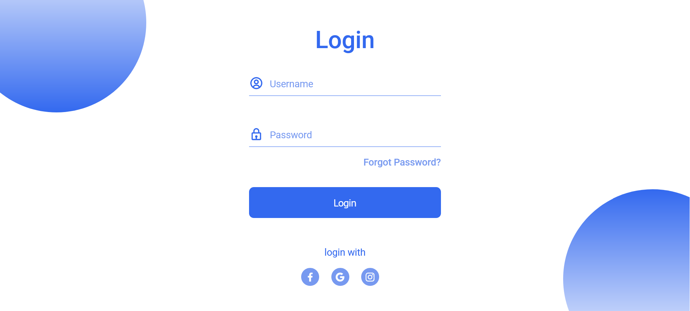
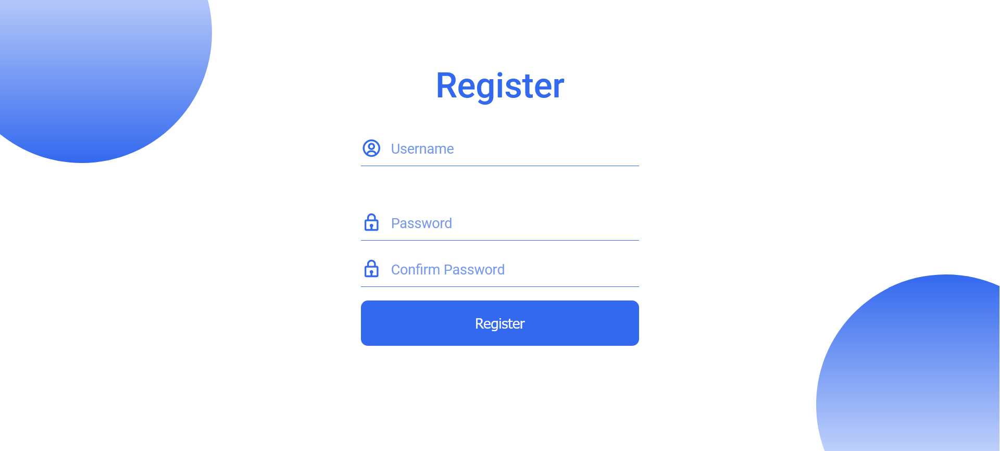
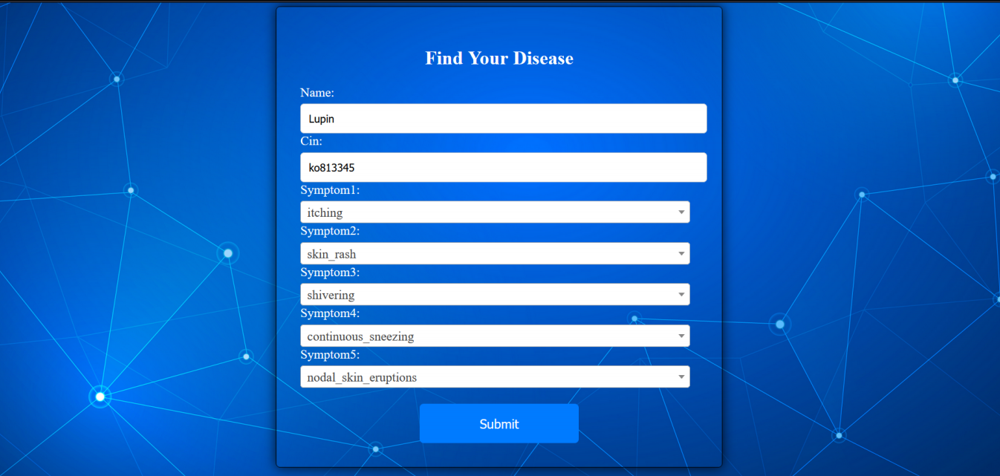
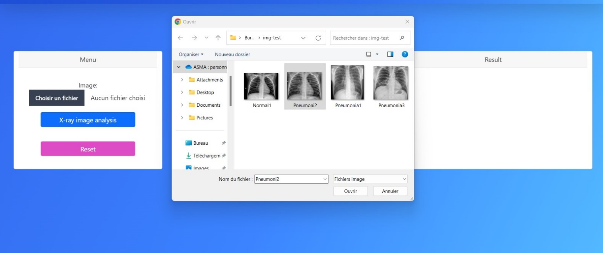
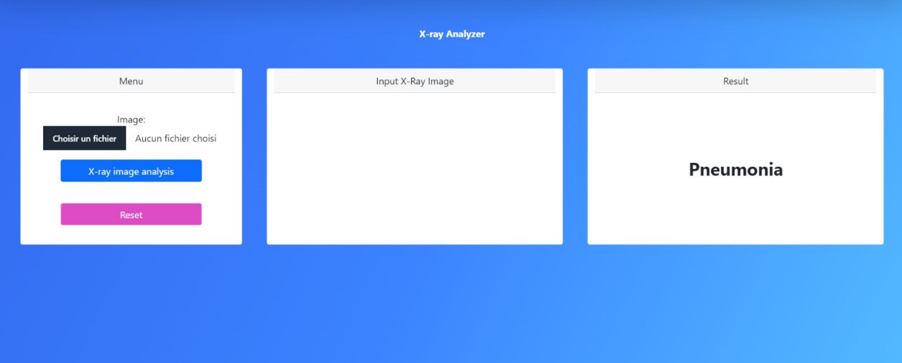

# MedSmart 
# Plateforme de Diagnostique Medicale Basé sur l’IA 
## Overview 
MedSmart est une application basée sur l'intelligence artificielle pour la détection de maladies respiratoires, principalement programmée en Python.
Elle utilise l'analyse d'images radiographiques pour diagnostiquer la pneumonie et la tuberculose.

  

## Introduction 
Ce projet vise à résoudre les défis rencontrés dans le domaine médical, notamment les délais dans les diagnostics, les erreurs humaines, et la gestion de grandes quantités de données radiographiques.

Notre application, développée en Python, utilise l'intelligence artificielle pour analyser des images radiographiques et détecter avec précision des maladies comme **la pneumonie** et **la tuberculose**. En s'appuyant sur des techniques de **réseaux neuronaux convolutifs** et **des algorithmes d'apprentissage profond**, l'application permet un diagnostic rapide et précis, contribuant à l'efficacité des professionnels de la santé dans la prise de décision clinique.

## Caractéristiques

- **Analyse d'images radiographiques** : Identification précise des signes de la pneumonie et de la tuberculose à partir des radiographies pulmonaires.
- **Diagnostic en temps réel** : Analyse rapide et précise des images radiographiques pour un diagnostic en temps réel.
- **Apprentissage profond** : Utilisation d'algorithmes d'apprentissage profond et de réseaux neuronaux convolutifs pour extraire des motifs visuels pertinents.
- **Amélioration de l'efficacité clinique** : Réduction des délais de diagnostic et amélioration de la précision grâce à l'automatisation des analyses d'images.

## Interface utilisateur
**Page d'accueil** :

Sur cette page, vous trouverez une liste complète de nos services, conçus pour répondre à une variété de besoins, chaque service étant accompagné d’une brève description expliquant son contenu et ses bénéfices pour nos utilisateurs.

**Page de Login** :

**Page de Register** :

**Formulaire de prediction** :
En cliquant sur le service **Symptom-Based Diagnosis Proposal**, vous serez dirigé vers une page où il vous faudra entrer le nom du patient, son CIN et les cinq symptômes principaux, ce qui permettra à l’algorithme de prédire la maladie.

**Resultat de prediction** :
Puis vous serez  conduit à la page des résultats, comme le montre la figure suivante.

**Prediction de tuberculose et pneumonie** :
En cliquant sur l’un des services suivants : **Pneumonia Detection** ou **Tuberculosis Detection**, vous serez dirigé vers une page où vous devrez télécharger l’image de la radiographie pulmonaire de votre patient et indiquer s’il s’agit de pneumonie ou de tuberculose. Ces informations seront ensuite utilisées comme entrées pour l’algorithme, qui tentera de prédire la présence de l’une de ces maladies.

 

